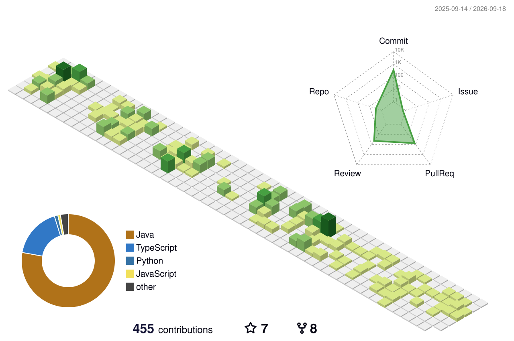

## SDET → Developer Experience Engineer

# Hi, I'm Mujtaba 👋

 

- 🔭 I'm currently a Test Engineer building scalable automation frameworks and CI/CD pipelines that give teams fast, reliable feedback
- 🌱 I'm transitioning into **Developer Experience / Platform Engineering** - improving how developers build, test, and ship software
- 👯 I'm open to collaborating on developer tooling, CI/CD, and internal platform projects
- 💬 Ask me about CI/CD pipelines, test automation, GitHub Actions, and developer tooling
- 📫 How to reach me: LinkedIn link at the end of this page
- ⚡ Fun fact: I'm a traveler, sports lover, and love meeting new people

 

## 🛠 Skills

**CI/CD & Platform** — GitHub Actions, CI/CD pipeline design, automated deployments, Docker, Kubernetes, Cloud (AWS/GCP/Azure)

**Developer Tooling** — Custom GitHub Actions, scripting (Python/Shell), internal tooling, docs & runbooks

**Test Engineering** — Web automation (Selenium, Cypress), mobile automation (Appium), API testing, scalable test frameworks

 

## 📦 Featured Projects

| Project | Description |
| --- | --- |
| [**apimatic-transformer-action**](https://github.com/mujjazi/apimatic-transformer-action) | A reusable GitHub Action built to run the APIMatic transformer as part of a workflow - developer tooling to automate API contract generation in CI |
| [**cypress_automation**](https://github.com/mujjazi/cypress_automation) | End-to-end web automation framework for a JavaScript (TypeScript/React Native) application using Cypress |
| [**mujjazi.github.io**](https://github.com/mujjazi/mujjazi.github.io) | My portfolio site - minimalist static site built with HTML/CSS |

 

## 📈 Contributions

 

<strong>Let's build better developer experiences. Connect with me on [LinkedIn](https://www.linkedin.com/in/mujtabamehdi9/) to chat about platform engineering, CI/CD, developer tooling, or quality engineering.</strong>
