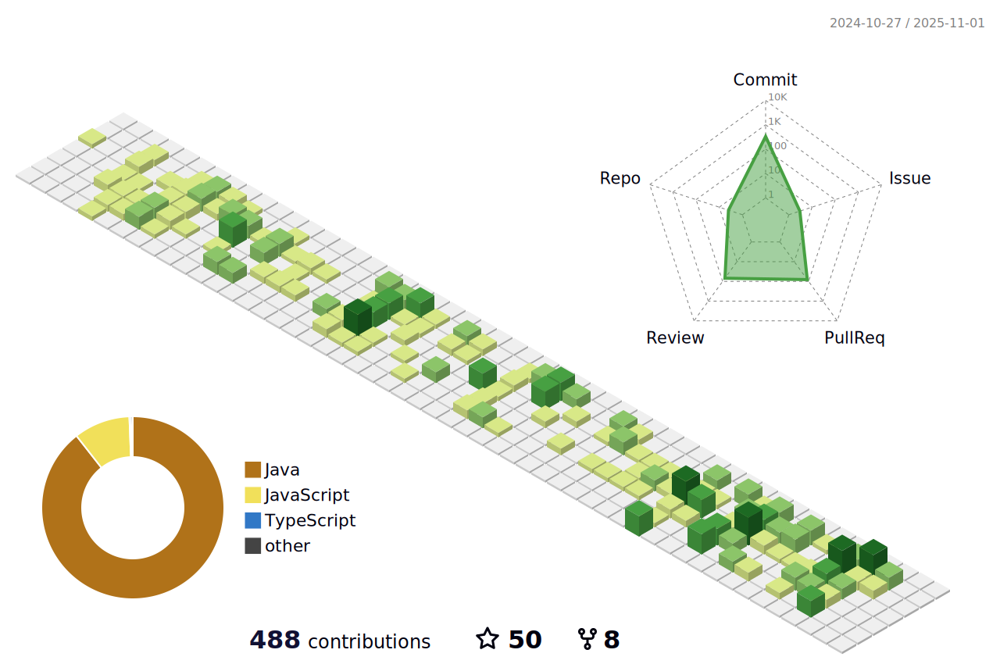

## Quality Coach and Test Automation 

# Hi there, Welcome to Mujtaba's profile 👋

 

- 🔭 I’m currently working as quality coach and advocating teams on how to improve the overall process for testing and development of quality products
- 🌱 I'm learning about containerization technologies like Docker and Kubernetes to improve our testing and deployment processes
- 👯 I'm interested in collaborating on open source automation frameworks or creating technical content related to DevOps practices
- 💬 Ask me about automation, developing frameworks for test automation or maintaining existing ones, quality coaching and devops
- 📫 How to reach me: mujtabamehdi71084@gmail.com
- ⚡ Fun fact: I am a traveler, sports lover and love to play Football and Table Tennis in my free time

 

<b>Feel free to connect with me on LinkedIn to discuss test automation or quality coaching or If you have any questions about automation frameworks or DevOps practices, don't hesitate to email me</b>

&nbsp; &nbsp; &nbsp; &nbsp; 

